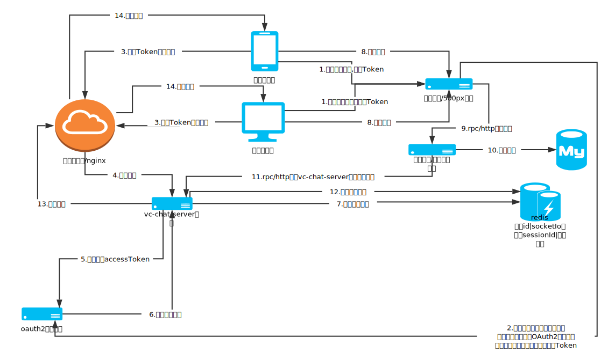

# vc-chat
---


### 开发环境

名称 | 说明
----|------
[Java](http://www.oracle.com/technetwork/java/javase/downloads/index.html) |Java开发环境 
[Intellij IDEA](https://www.navicat.com/en/products) | Java 开发工具 
[WorkBench](https://dev.mysql.com/downloads/workbench/) | 数据库连接工具 


### 依赖docker 环境
```
docker-compose -f ./docker/docker-compose.yml up -d
```

## 模块
---
|模块名 | 说明 | 启动类| 端口| 启动顺序
|---|---|---|---|---|
| [vc-chat-api](./vc-chat-api) | Api接口层|  无 | 无 |
| [vc-chat-configserver](./vc-chat-configserver) |  配置文件服务器,用于存放线上配置文件|com.vcg.chat.configserver.VcChatConfigServerApplication |  8888 | 1
| [vc-chat-discovery](./vc-chat-discovery) |服务注册中心,用于构建集群使用| com.vcg.chat.discovery.DiscoveryApplication|  8761 | 2
| [vc-chat-oauth2](./vc-chat-oauth2) | Oauth2安全验证,用于建立socketio连接的时候进行验证|com.vcg.chat.oauth2.VcChatOAuth2ServerApplication |   9999 | 3 
| [vc-chat-server](./vc-chat-server) |  使用socketio 用于接受连接和消息路由。不做逻辑处理。|com.vcg.chat.server.VcChatServerApplication |  web端口:8081,socketio端口: 1337 | 4
| [vc-chat-logic](./vc-chat-logic) |  逻辑处理层,用于消息存储与发送|com.vcg.chat.logic.VcChatLogicApplication|  8082 |  5
| [vc-chat-sample](./vc-chat-sample) |  演示项目,依赖上层服务所有都启动(实现部分)|com.vcg.chat.sample.VcChatSampleApplication|  8080 |  6

### vc-chat-server
---

#### 架构图


#### socketio example
1. [SocketIOExample](./docs/api/SocketIOExample.md)


### vc-chat-logic
---

#### 后端存储

Mysql 已实现
> 使用简单,但是不适合单表比较大,如果使用建议分表.

Cassandra 待实现
> Cassandra 的数据模型是基于列族(Column Family)的四维或五维模型。
> 它借鉴了 Amazon 的 Dynamo 和 Google's BigTable 的数据结构和功能特点，采用 Memtable 和 SSTable 的方式进行存储。
> 在 Cassandra 写入数据之前，需要先记录日志 (CommitLog),然后数据开始写入到 Column Family 对应的 Memtable 中,Memtable 是一种按照 key 排序数据的内存结构.
> 在满足一定条件时，再把 Memtable 的数据批量的刷新到磁盘上，存储为 SSTable.

DynamoDB 待实现

TableStore 待实现

HBase 待实现

分片规则:
1. user_dialogue 表建议以user_id 作为分片键
2. pri_message 表建议以 dialogue_id 作为分片键


#### 表结构

1. [user_dialogue 好友列表](./docs/model/UserDialogue.md)
2. [pri_message 消息存储表](./docs/model/PriMessage.md)
3. [system_message 系统广播消息表](./docs/model/SystemMessage.md)
4. [user_system_message 用户已经接收到的系统广播消息记录表](./docs/model/UserSystemMessage.md)

#### Questions

Q. 架构图给箭头增加数字标号，并给出几个场景，以及相应的箭头数字顺序（比如用户登录，是箭头 1 -> 3 -> 6 -> 9 这么一个流程）
Q. 完善两个表中对于不同 type 取值对其他列的影响 （比如 pri_message.type为关注时，uni_id怎么取值？user_dialogue.type为部落时to_user_id/parent_id/parent_make如何取值？等等）
Q. “500px摄影社区”的广播逻辑和数据存储格式


Q.vc-chat-server集群内路由转发逻辑细节

1. 前台有阿里云网关/Nginx网关进行转发。由于阿里云网关/Nginx只能做ip_hash/RoundRobin进行转发代理到固定机器。不能按照业务逻辑用户id进行转发代理,所以集群下，一个用户可能会连接到不同的vc-chat-server服务器中。
2. 每台vc-chat-server服务器，都维持一个本地路由表和远程路由表.当一个客户端建立连接时,首先通过OAuth2 进行验证,验证通过后拿到用户id，首先进行远程存储,然后进行本地连接存储
3. 当被调用到multiPush 接口时,会先根据用户id查询远程路由表。拿到远程路由表后进行遍历，如果用户建立的连接是本机，将直接调用SocketIoClient 进行推送,如果是当前用户建立的连接不是本机，组装Request，通过调用singlePush
转发到远程路由表中相关建立连接的服务器中.

远程存储结构：
1. 类型为map, key为 chat:users:userId  
2. 存储格式
```
{
  "clientLocation": {
    "clientType": "web",
    "host": "192.168.19.167",
    "port": 8081,
    "sessionId": "340bfe7e-16d5-45e1-ac90-79ce056e198e"
  },
  "offline": false,
  "online": true
}
```
名称 | 说明
---|---
clientType | 客户端类型(暂未使用)
host|客户端所连接的服务器ip地址
port|客户端所连接的服务器端口号
sessionId|socketio建立连接的sessionId
offline|离线(暂未使用)
online|在线(暂未使用)

本地存储结构：
1. key 类型为map 
2. 存储格式: Map<用户id,Map<sessionId,SocketIOClient>>  


Q. vc-chat-server集群内怎么做ios/android push notification的

1. 现阶段未自己实现相关Notification，使用的第三方提供Notification的支持。可以自己做Notification的通知
2. IOS使用 [友盟推送](https://adplus.umeng.com/index.php) 第三方提供Notification的支持
3. Android [小米推送](https://dev.mi.com/console/appservice/push.html) 第三方提供Notification的支持

Q. 解释为什么 type需要冗余存储

1. 现阶段共有9总消息类型分别是 0 普通消息 1 系统消息 2 点赞  3 关注 4 评论消息 5 作品 6 部落 7 签约 8 活动。以上消息除了普通消息，每个类型对应一个系统用户。当时为了单独过滤出相关消息列表，
使列表不混入用户消息列表里,做单独呈现。 当前已经取消这种方式,改用 ordered 字段做相关排序,设置系统消息的权重为比较大的值。使其排在最前。Type 只做冗余查询使用(暂时还未使用到)


### api

1. [LogicApi](./docs/api/LogicApi.md)
2. [ServerApi.md](./docs/api/ServerApi.md)

## 本项目已使用框架
|技术 | 名称 | 官网|
|---|---|---|
|Maven | 项目构建管理  | [http://maven.apache.org/](http://maven.apache.org/)|
|SpringMVC | MVC框架  | [http://docs.spring.io/spring/docs/current/spring-framework-reference/htmlsingle/#mvc](http://docs.spring.io/spring/docs/current/spring-framework-reference/htmlsingle/#mvc)|
|SpringBoot | spring快速开发框架 | [https://projects.spring.io/spring-boot/](https://projects.spring.io/spring-boot/)|
|SpringCloud | Spring Cloud是一系列框架的有序集合 | [https://projects.spring.io/spring-cloud/](https://projects.spring.io/spring-cloud/)|
|Spring Session | 分布式Session管理  | [http://projects.spring.io/spring-session/](http://projects.spring.io/spring-session/)|
|Spring OAuth2 | SSO  | [https://projects.spring.io/spring-security-oauth/](https://projects.spring.io/spring-security-oauth/)|
|Swagger2 | 接口测试框架  | [http://swagger.io/](http://swagger.io/)|
|MyBatis | ORM框架  | [http://www.mybatis.org/mybatis-3/zh/index.html](http://www.mybatis.org/mybatis-3/zh/index.html)|
|Spring Data | Orm 封装  | [https://projects.spring.io/spring-data/](https://projects.spring.io/spring-data/)|
|RabbitMq | 消息队列  | [http://www.rabbitmq.com/](http://www.rabbitmq.com/)|
|SocketIO Java版实现 | WebSocket框架服务端  | [https://github.com/mrniko/netty-socketio](https://github.com/mrniko/netty-socketio)|
|SocketIO 其他语言客户端 | WebSocket客户端  | [https://socket.io/](https://socket.io/)|
|Docker | 容器框架  | [https://www.docker.com/](https://www.docker.com/)|

## 后端可选框架框架:
|技术 | 名称 | 官网|
|---|---|---|
|Spring Framework | 容器  | [http://projects.spring.io/spring-framework/](http://projects.spring.io/spring-framework/)|
|SpringMVC | MVC框架  | [http://docs.spring.io/spring/docs/current/spring-framework-reference/htmlsingle/#mvc](http://docs.spring.io/spring/docs/current/spring-framework-reference/htmlsingle/#mvc)|
|SpringBoot | spring快速开发框架 | [https://projects.spring.io/spring-boot/](https://projects.spring.io/spring-boot/)|
|SpringCloud | Spring Cloud是一系列框架的有序集合 | [https://projects.spring.io/spring-cloud/](https://projects.spring.io/spring-cloud/)|
|Spring Session | 分布式Session管理  | [http://projects.spring.io/spring-session/](http://projects.spring.io/spring-session/)|
|Spring Security | 安全验证框架  | [https://projects.spring.io/spring-security/](https://projects.spring.io/spring-security/)|
|Spring OAuth2 | SSO  | [https://projects.spring.io/spring-security-oauth/](https://projects.spring.io/spring-security-oauth/)|
|Spring Data | Orm 封装  | [https://projects.spring.io/spring-data/](https://projects.spring.io/spring-data/)|
|MyBatis | ORM框架  | [http://www.mybatis.org/mybatis-3/zh/index.html](http://www.mybatis.org/mybatis-3/zh/index.html)|
|MyBatis Generator | 代码生成  | [http://www.mybatis.org/generator/index.html](http://www.mybatis.org/generator/index.html)|
|Thymeleaf | 模板引擎  | [http://www.thymeleaf.org/](http://www.thymeleaf.org/)|
|Swagger2 | 接口测试框架  | [http://swagger.io/](http://swagger.io/)|
|Jenkins | 持续集成工具  | [https://jenkins.io/index.html](https://jenkins.io/index.html)|
|Flyway | 使用Java API轻松完成数据库迁移 | [http://flywaydb.org/](http://flywaydb.org/)|
|RxJava | 使用JVM中可观察序列，创建异步、基于事件应用程序的函数库 | [https://github.com/Netflix/RxJava](https://github.com/Netflix/RxJava)|
|Disruptor | 线程间消息函数库 | [http://lmax-exchange.github.io/disruptor/](http://lmax-exchange.github.io/disruptor/)|
|Netty | 构建高性能网络应用程序开发框架 | [http://netty.io/](http://netty.io/)|
|Ff4j | 功能切换 |  [https://github.com/clun/ff4j](https://github.com/clun/ff4j)|


## Intellij Idea 开发插件
技术 | 名称 | 地址
----|------|----
Lombok | 简化Pojo |[https://projectlombok.org/](https://projectlombok.org/)

#### 开发规范
1. [阿里巴巴开发规范](https://github.com/alibaba/p3c/blob/master/阿里巴巴Java开发手册（终极版）.pdf)
2. [Google开发规范](http://google-styleguide.googlecode.com/svn/trunk/javaguide.html)[中文](https://segmentfault.com/a/1190000002761014)

#### 快速构建应用
1. [Start spring](http://start.spring.io)
2. [Jhipster](https://start.jhipster.tech/#/)

## 构建应用并启动